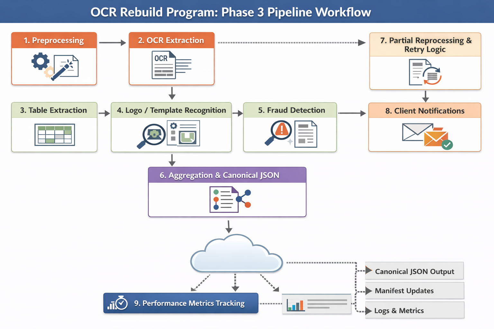

# Phase 3 OCR Pipeline Workflow

The following diagram illustrates the end-to-end Phase 3 OCR pipeline workflow, including preprocessing, OCR extraction, table extraction, logo/template recognition, fraud detection, aggregation, partial reprocessing, client notifications, and performance metrics tracking.

**Figure:** Phase 3 pipeline workflow. Image stored in S3 at: 
`s3://ocr-rebuild-program/docs/01_architecture/phase3_pipeline_workflow.png`

Developers should reference this image for pipeline implementation and field mapping, following the canonical and manifest schema.
